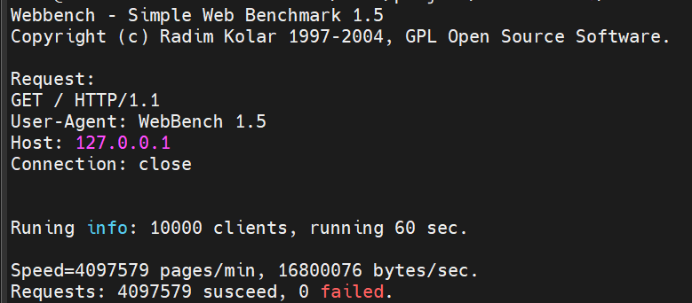
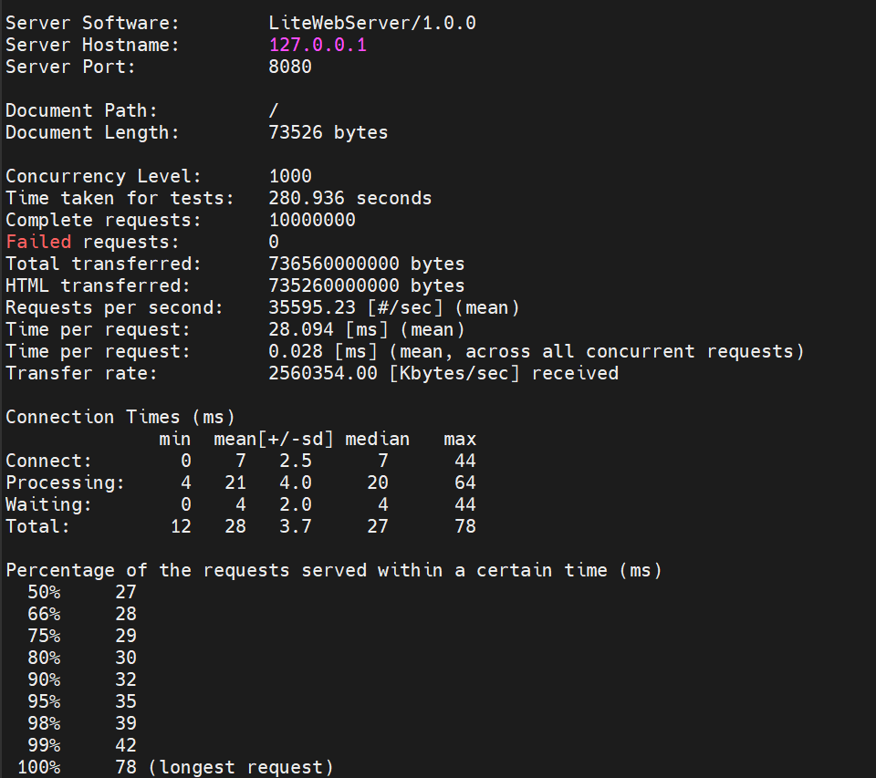
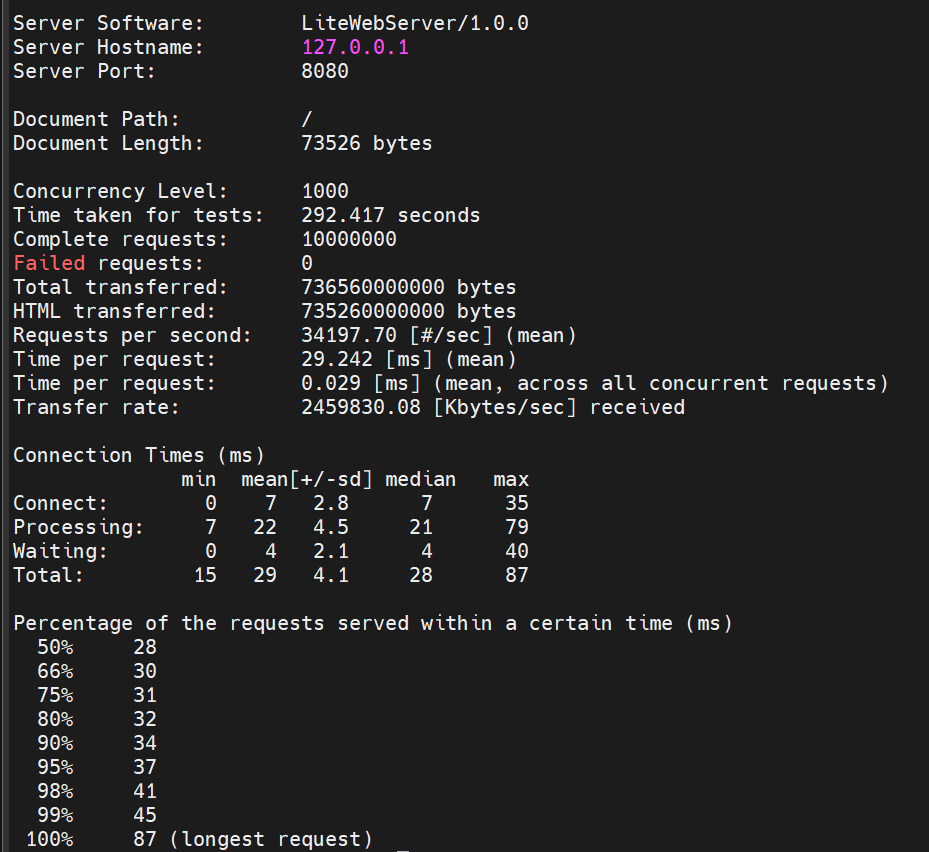
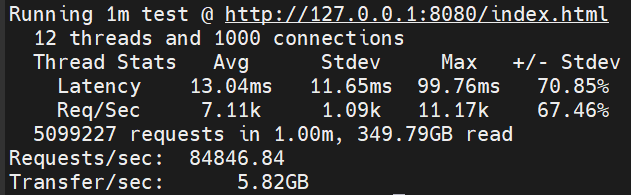
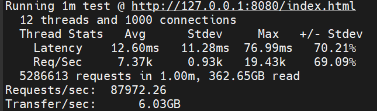

# README

### 介绍

一个C++实现的简单，但性能还不错的web server，学习用，代码结构简单，功能陆续添加中

单服务，多线程，万级并发，支持自定义路由

### 编译环境及说明

**C++版本：>=C++11(C++11和C++14测试通过)**

在项目根目录下:
```bash
mkdir build
cd build
cmake ..
make
```

### 用法

编译后build目录下执行：`./litewebserver`

### 测试环境及性能

测试环境：

虚拟机：Ubuntu 22.04.4 LTS

处理器：13th Gen Intel® Core™ i5-13500HX（虚拟机8核）

内存：8GB

服务程序，测试程序在同一台虚拟机

**1. WebBench测试**
   
   4线程，10000客户端，禁用所有日志，短连接，测试60秒，简单页面测试：

   ```C++
   static const std::string index_body = "<!DOCTYPE html>\r\n"
                                      "<html>\r\n"
                                      "<head><title>Simple Web Server</title></head>\r\n"
                                      "<body><h1>Hello, World! This is a simple web server.</h1></body>\r\n"
                                      "</html>\r\n";
   ```

   ```bash
   ./webbench -t 60 -c 10000 -2 --get http://127.0.0.1:8080/
   ```

   LT+LT模式，约 64416 QPS，ET(accept连接)+LT模式，约 68292 QPS，因为实现中LT和ET均采用了一次性accept的方式，所以实际上差的不是很大

   LT+LT：

   

   ET+LT：

   

**2. Apache Bench测试**

   4线程，1000客户端，一千万次请求，很少的文件日志，短连接，单页73526 bytes：

   ```bash
   ab -n 10000000 -c 1000 http://127.0.0.1:8080/
   ```

   LT+LT模式，约35595 QPS，ET(accept连接)+LT模式，约 34197 QPS，感觉ab测试没有上强度，CPU的使用率都很低，跑出来的结果也不太理想，应该是测试参数没选好的问题，不过可以发现ET+LT模式的QPS差不多，所以只要设计好LT和ET应该差的不是很大

   LT+LT：
  
   

   ET+LT：

   

**2. wrk测试**

   12线程，1000客户端，很少的文件日志，短连接，测试60s，单页73526 bytes：

   ```bash
    wrk -t12 -c1000 -d60s http://127.0.0.1:8080/index.html
   ```

   LT+LT模式，约84846 QPS，ET(accept连接)+LT模式，约 87972 QPS，wrk看起来是压力最大的，多个线程的CPU使用率都在90%左右，所以QPS也是最高的，测试也再次印证设计好的LT和ET应该差的不是很大，不过这都是建立在只有accept连接为ET模式的基础上，后续实现全ET模式还会再测下

   LT+LT：
  
   

   ET+LT：

       

### 感谢

TinyWebServer：https://github.com/qinguoyi/TinyWebServer

WebServer：https://github.com/linyacool/WebServer

### 三方库

spdlog（日志）: https://github.com/gabime/spdlog

ThreadPool（线程池）：https://github.com/progschj/ThreadPool
